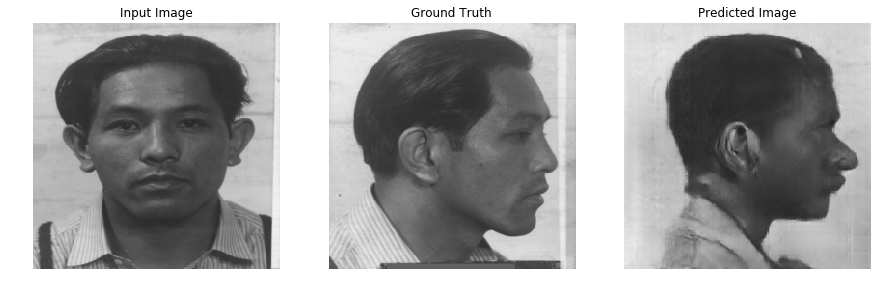

    
    
    
    

# mugshots

NOTE: currently, only the tf_mushot notebook works.

The following papers are used for reference:

* [Image-to-Image](https://arxiv.org/abs/1611.07004)
* [U-Net](https://arxiv.org/abs/1505.04597)
* [Noise2Noise](https://arxiv.org/abs/1803.04189)

For this project I used the [mugshots](https://www.nist.gov/srd/nist-special-database-18) dataset from the National Institute of Standards and Technology (NIST).

The main idea behind the "mugshots" project is to be able to generate a side view from a given image showing the front view of a face. I know what you are probably thinking, "what are you thinking, that's not possible."  Nonetheless, after reading the Image-to-Image paper and U-Net paper and some others covering the topic of a generative adversarial network (GAN), I thought it would be a fun project to try it out -- anyway. The GAN model I implemented is based on these papers with some alterations.
